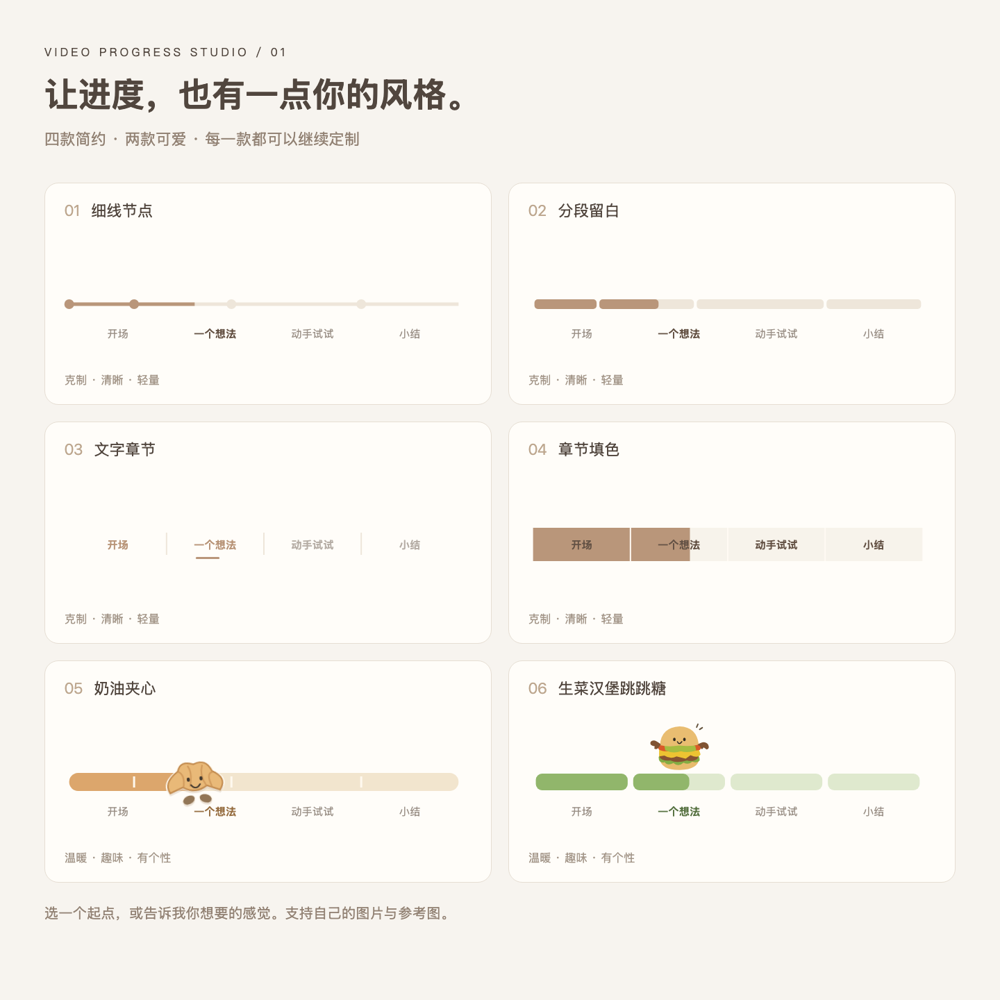

# Video Progress Studio

**把字幕交给 AI，做一条有网感的视频进度条。**

你是不是也经常刷到这种很好看的视频进度条？看了不少教程，真正动手时，还是要自己分章节、调颜色、摆贴纸、对时间，捣鼓好久。

所以我做了这个 Skill：让 AI 帮你处理章节整理和进度条制作。你来选喜欢的样式、告诉它想改什么，最后把生成的透明视频拖回剪辑软件。

内置 **6 款模板：4 款简约常见款，2 款卡通可爱款**。知识口播、教程可以从简约款开始，vlog 可以试试小可颂和小汉堡。颜色、文字和卡通款的贴纸都能自定义。

**选样式 → 提供字幕 → 预览调整 → 导出透明视频。** 也可以先把字幕发给 AI，再让它引导你选款式。日常使用主要通过对话完成，不需要自己修改代码。



## 六款预设

| 样式 | 效果 |
| --- | --- |
| **01 · 细线节点** | 细线搭配圆点，用轻量的方式标记章节和进度。 |
| **02 · 分段留白** | 圆角短条分隔章节，随着播放逐渐填色。 |
| **03 · 文字章节** | 以章节名为主，用文字颜色和下划线提示当前进度。 |
| **04 · 章节填色** | 文字后面的色块从左向右填满，已播放的章节保持填色。 |
| **05 · 奶油夹心** | 小可颂嵌在奶油色进度条里，随进度移动、轻轻摇动。 |
| **06 · 生菜汉堡跳跳糖** | 笑脸小汉堡跳到当前章节，绿色分段逐格填满。 |

**这六款只是起点。** 你可以说「我喜欢第 3 款，但想换成粉色」，也可以描述全新的感觉，让 Agent 基于现有组件修改。

## 怎么开始？

### 1. 把 Skill 交给你的 AI Agent

如果你的 Agent 支持从 GitHub 安装 Skill，可以把下面这段话直接发给它：

```text
请帮我安装这个视频进度条 Skill：
https://github.com/keni112403/video-progress-studio

安装后先展示六款样式，再引导我提供字幕、制作进度条。
```

如果工具不支持直接安装链接，可以下载本仓库的 ZIP 并解压，按该工具的安装方式添加整个文件夹；也可以让 Agent 读取文件夹里的 `SKILL.md`，按说明工作。

本项目已在 **Codex 本地环境**跑通。其他 Agent 需要具备读取本地文件、修改代码和执行命令的能力。不同工具的安装和调用方式不同，请使用它支持的 Skill 入口，或直接用自然语言指定这个 Skill。

### 2. 让 Agent 展示样式

安装后，在 Codex 中可以这样说：

```text
用 $video-progress-studio 帮我做一个视频进度条。
先让我看看六种样式，选好后我会提供字幕。
```

其他 Agent 可以这样说：

```text
请读取 video-progress-studio 文件夹里的 SKILL.md，按说明帮我制作视频进度条。
先展示预设样式，再引导我提供内容和时间信息。
```

已经有想法的话，也可以一步说清楚：

```text
用奶油夹心样式，根据我提供的 SRT 字幕整理章节。
视频是 9:16 竖屏，进度条放顶部，颜色保持奶油色。
先给我预览，确认后导出透明 MOV。
```

### 3. 提供内容，查看预览

从你已经剪好的视频中导出 **SRT 字幕文件**，交给 Agent 就可以了；也支持 VTT。这里需要的是带时间码的字幕文件，而不是画面里已经显示出来的字幕。

Agent 会根据字幕内容建议章节划分、提炼简短标题，并按时间码制作进度条。你可以直接修改它给出的章节和标题。

建议使用最终剪辑版本的字幕。如果后面又删减、挪动了视频片段，需要同步更新时间，进度条才能继续对齐。

不一定要字幕，也支持：

| 你提供的内容 | 可以完成什么 |
| --- | --- |
| 带时间码的 SRT / VTT | 根据内容整理章节，并生成同步的进度条。 |
| 章节名＋开始时间＋视频总时长 | 直接按你给定的章节制作。 |
| 普通文字稿或大纲 | 先讨论章节和视觉样式；准确导出前，需要补充时间信息。 |

手动提供时间时，可以用这样的格式：

```text
视频总时长：3 分 20 秒
0:00 开场
0:25 为什么需要这个工具
1:10 实际演示
2:45 总结
```

字幕最后一句结束后，视频可能还有片尾或留白。如果有，请一并告诉 Agent 实际总时长。

### 4. 调整并导出

在预览阶段，你可以直接说：

- 「把颜色换成淡绿色。」
- 「章节标题再短一点。」
- 「不要文字，只保留进度标记。」
- 「把可颂换成我上传的透明 PNG。」
- 「改成 4:3，放在底部。」

满意后说「帮我导出透明视频」。你会得到一个透明背景的进度条文件。

把它拖回支持该格式的剪辑软件，放在主视频上方的轨道，与视频起点对齐，再播放检查一遍，就完成了。

## 可以调整哪些内容？

- **画面比例：**16:9、9:16、4:3、1:1。
- **位置：**顶部或底部。
- **配色：**已播放部分、未播放部分、文字颜色。
- **文字：**章节标题、显示或隐藏。
- **贴纸：**两款卡通样式可替换为自己的图片，推荐透明背景 PNG / WebP。
- **更多样式：**由 Agent 修改组件，实现新的布局或动作。

尺寸、颜色等常用设置可以通过配置修改；新造型和新动作需要 Agent 编辑组件，并重新检查效果。

## 导出格式

默认输出 **带透明通道的 ProRes 4444 MOV**，画布尺寸与所选视频比例一致。

本项目已验证样片的尺寸、帧率和透明通道，但尚未逐一验证所有剪辑软件的导入。具体支持情况取决于软件、平台和版本；桌面版与手机版也可能不同。

普通 H.264 MP4 不适合作为这里的透明交付格式。如果文件在播放器里看起来是黑底，不一定代表透明通道丢失，可以在剪辑软件中叠到其他画面上检查。

## 本地运行与开发

如果你通过 Agent 使用，可以让它完成以下步骤。

运行需要 Node.js 与 npm；字幕解析脚本使用 Python 3，独立检查导出文件可使用 FFmpeg / ffprobe。首次使用可能需要安装依赖和下载浏览器运行环境；完成时间还取决于视频长度、分辨率和电脑性能。

```bash
npm install
npm run preview
```

预览界面中的三个入口：

- `StyleGallery`：六款动态样式总览。
- `CartoonPlayground`：可颂和汉堡的设计演示。
- `Overlay`：用于制作和导出的透明进度条。

使用示例配置预览：

```bash
npm run preview -- --props examples/burger.json
```

在预览界面选择 `Overlay`。导出汉堡款：

```bash
node scripts/export.mjs examples/burger.json out/progress.mov
```

奶油夹心示例为 `examples/cream.json`。制作自己的视频时，请先复制示例配置，修改总时长与章节时间。详细字段见 [配置说明](references/configuration.md)。

字幕解析示例：

```bash
python3 scripts/prepare_subtitles.py examples/sample.srt out/cues.json
```

该脚本只提取字幕和时间，**章节归纳由 Agent 根据内容完成**。

## 项目文件

```text
video-progress-studio/
├── SKILL.md                  # Agent 使用说明
├── README.md                 # 中文介绍
├── src/                      # 进度条、角色与预览组件
├── scripts/                  # 字幕解析与透明视频导出
├── examples/                 # 配置和字幕示例
├── previews/                 # 样式预览图
├── public/                   # 工作时放置自定义贴纸，可自行创建
└── references/               # 配置说明
```

## 许可与素材

项目代码采用 [MIT License](LICENSE)。Remotion 等依赖遵循各自的许可，使用时请查看 [Remotion 许可说明](https://www.remotion.dev/license)。

内置角色为可编辑的矢量插画，仓库不包含个人参考照片。添加自己的图片时，请确认你拥有相应的使用和分享权限。

---

Made by [Keni](https://github.com/keni112403) · 让进度，也有一点你的风格。
